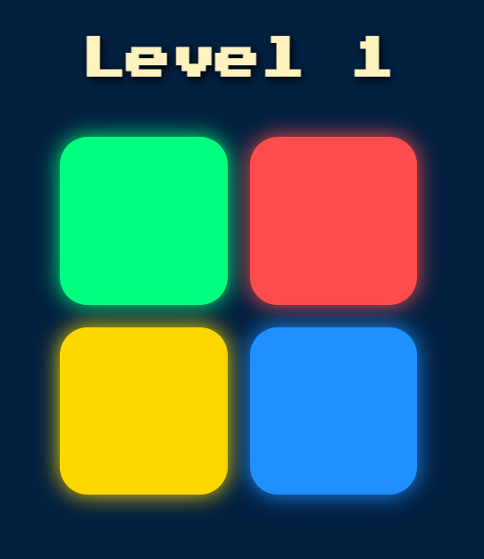

# Simon-Game
🎮 A fun and interactive Simon Game built using HTML, CSS, and JavaScript. Test your memory skills by repeating color sequences that get harder with each level!
# 🎮 Simon Game

A fun and interactive **memory game** built using **HTML, CSS, and JavaScript**. The classic Simon Game challenges players to repeat an ever-growing sequence of colors. How long can you keep up?

## 🧠 How to Play

1. Press any key (or tap the heading) to start the game.
2. Watch the sequence of button flashes and sounds.
3. Repeat the sequence by clicking the buttons in the correct order.
4. With each level, a new color is added to the pattern.
5. If you click the wrong button — game over!

---

## 🚀 Features

- 🔊 Sound feedback for each color
- ✨ Smooth animations and glowing button effects
- 📱 Mobile-friendly and responsive layout
- 💥 Game Over screen with shake effect
- ⌨️ Keyboard + tap support

---

## 🛠️ Built With

- HTML5
- CSS3 (with custom styling)
- JavaScript + jQuery

---

## 📂 Folder Structure

Simon-Game/
│
├── index.html # Main game page
├── styles.css # All styling and layout
├── game.js # Core game logic
└── sounds/ # Sound files (red.mp3, blue.mp3, etc.)

---

## 🌐 Live Demo

🔗 [Play the Game Here](https://rishita-paliwal.github.io/Simon-Game/)  

---

## 📸 Preview

  

---

## 🤍 Author

**Rishita Paliwal**  
[GitHub](https://github.com/Rishita-Paliwal)

---

## 📄 License

This project is open-source and free to use.

